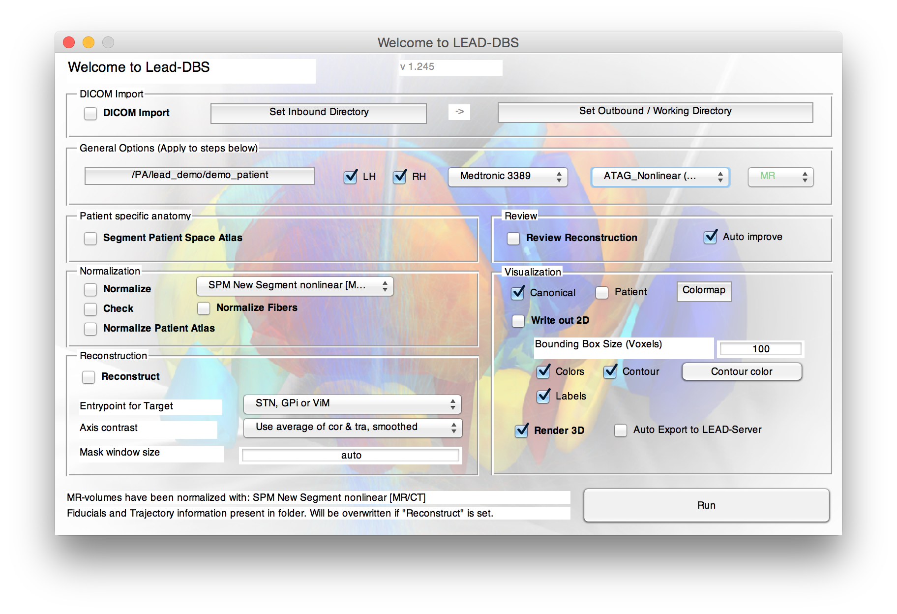
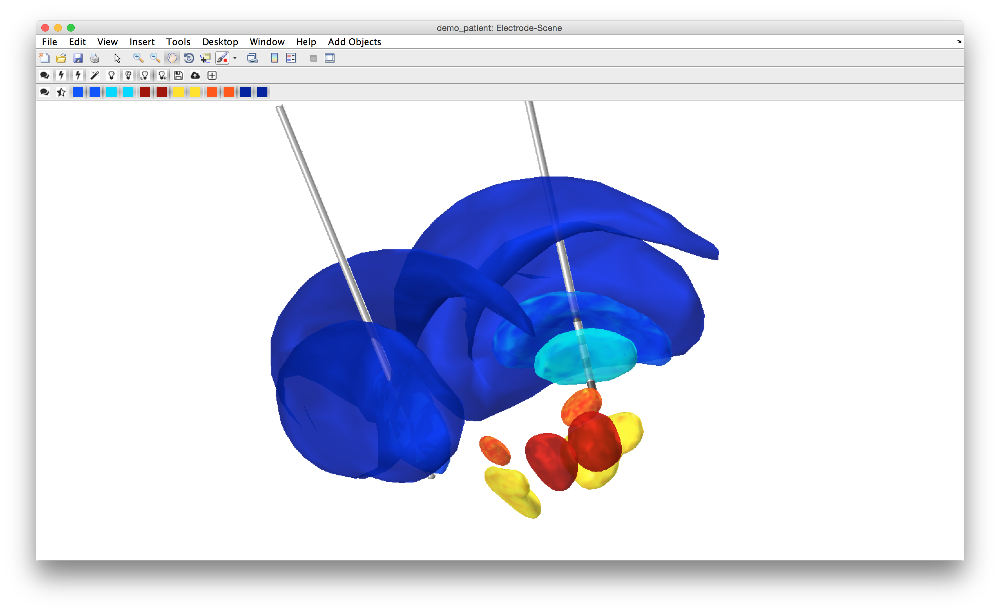

## Visualizing the Electrode localization in 3D

If you set the `Render 3D` button in the LEAD main window and press the run button, the LEAD 3D viewer will pop up and will render the reconstructed electrodes and the atlas components the toolbox finds in the atlas directory selected in the main window. This figure can be rotated in 3D using the built-in MATLAB 3D-rotation tool and atlas components can be hidden (and shown back again) by pressing the according colored toggle-buttons in the secondary toolbar of the viewer (press the `alt`-key to hide/show all atlases of the set – this only works if no other tool, such as the MATLAB 3D-rotation tool is selected).

*Options set to run 3D-visualization*

*Example view, 3D-viewer*

The following fields of the LEAD mainwindow influence the results of the 3D visualization:

* `Patient directory`: The patient to be visualized. Please make sure that both normalization and reconstruction steps have been performed and results are accurate (use the `Check`-Checkbox in the `Normalization`-panel and the `Review Reconstruction`-checkbox in the `Review`-panel to visualize accuracies in both steps).
* `Atlas-Dropdown menu`: Select the atlas set you want to visualize alongside the electrode reconstruction.
* `Canonical` and `Patient` checkboxes: Using these you can specify whether you want to visualize canonical or “patient specific” anatomy. The latter needs to be built first and the feature has not been evaluated, i.e. should not be used at time of this writing.
* `Colormap` button: Choose a colormap for atlas visualization here. LEAD will automatically assign different color intensities (1-64) to each atlas component. You can change these intensities in the `altases_index.mat` which is built the first time you visualize an atlas set (also see section 7.1).

The 3D-viewer will open once you press the `Run`-button. The following actions are available from the 3D-viewer window:

* `Electrode labels`-button: Shows/hides the patient names at the top of each electrode displayed. This is especially helpful when visualizing groups of patients.
* `Show Electrode`-buttons: For each electrode shown, there is a toggle button with which you can show/hide it. As long as no other tool is active (e.g. the MATLAB 3D-view tool), you can press the `alt`-button to show/hide all electrodes at once (helpful when visualizing groups of patients.
* `Stimulation control figure`-button: This button opens the stimulation settings window. Using this window, you can perform simulate stimulations and perform fiber-tracking from the volume of activated tissue.
* `Lightbulb`-buttons: Several buttons help you to change lighting effects.
* `Save Scene`-button: Use this button to export a high-definition screenshot of the active view as a _.png_-File. Please note that this button will export a better quality rendering of the scene than the built-in MATLAB save button.
* `Export to server`-button: Use this button to export the scene as a web-browser compatible rendering (using BrainBrowser and WebGL technology).
* `Slice control figure`-button: Opens the anatomy control figure which can be used to add x-, y- and z-slices of an MR image to the scene. You can choose to visualize the MNI template, the pre-/post-op MR images of the current patient or a different image. This control figure can also be used to only show a 2D-like slice of the current scene in x-, y- or z-axis
* `Labels`-button: This button toggles the visibility of labels of the atlas components.
* `Label-color`-button: Use this button to set the color in which the labels should be visualized.
* `Save video`-button: Use this button to export a video of the current scene. This is done based on preferences set in `ea_prefs.m`
