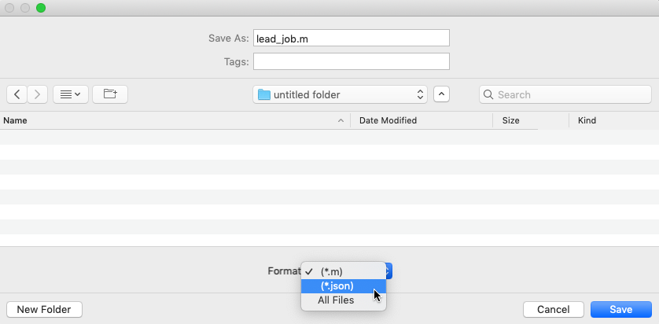

# Command line interface

Lead-DBS can now also be accessed from the command-line in the standalone version.

To run lead, open a terminal in the application folder of the standalone release and run the `run_lead.sh` script specifying  the path to [Matlab Runtime](https://www.mathworks.com/products/compiler/matlab-runtime.html) \(currently v96\). For example, in Mac:

```text
./run_lead.sh /Applications/MATLAB/MATLAB_Runtime/v96
```

As in Matlab, it is possible to directly open Lead-DBS or Connectome, etc using the keywords `dbs` , `connectome` , `group` and so on.

```text
./run_lead.sh /Applications/MATLAB/MATLAB_Runtime/v96 dbs
```

### Running lead processes from the command line

It is also possible to execute a process **without** the lead GUI by specifying further options. For example, in order to run coregistration and normalization using the Segment algorithm:

```text
./run_lead.sh /Applications/MATLAB/MATLAB_Runtime/v96 dbs -coreg_checkbox -normalize_checkbox -normmethod 2 /path/to/patient/dir
```

Where `path/to/patient/dir` is the directory of the patient.  Multiple patients can be processed by entering all their directories.

Command line options are defined the same way as the handles name in the GUI. It is possible to query them opening the `lead_dbs.fig` in GUIDE and clicking the desired component. A non extensive list of options is also listed in the [Command line options](command-line-options.md) page.

Using the `-process`  option the basic Lead-DBS pipeline is executed: coregistration, normalization, brain shift correction and electrode reconstruction \(PaCER\). For example:

```text
./run_lead.sh /Applications/MATLAB/MATLAB_Runtime/v96 dbs -process /path/to/patient/dir
```

When using the `-process`  option it is also possible to specify [BIDS](https://bids.neuroimaging.io/) subject directory\(s\). In this case the subject images will be processed in a derivates \(Lead\_DBS-like\) folder. If a BIDS root directory is set, then all of its subjects will be processed.

### Running exported jobs from the command line

Exported jobs created with the _Export Code_ button can be run from the command line using the `execute` command and specifying the file location:

```text
./run_lead.sh /Applications/MATLAB/MATLAB_Runtime/v96 execute /path/to/lead_job.json
```

It's **important** to remark that the file is in `.json` format. This option must be set in the exporting code dialog:



Finally, it is also possible to edit this `.json` file with a text editor and run the desired processes \(without the need to specify every option as in the previous section\).


