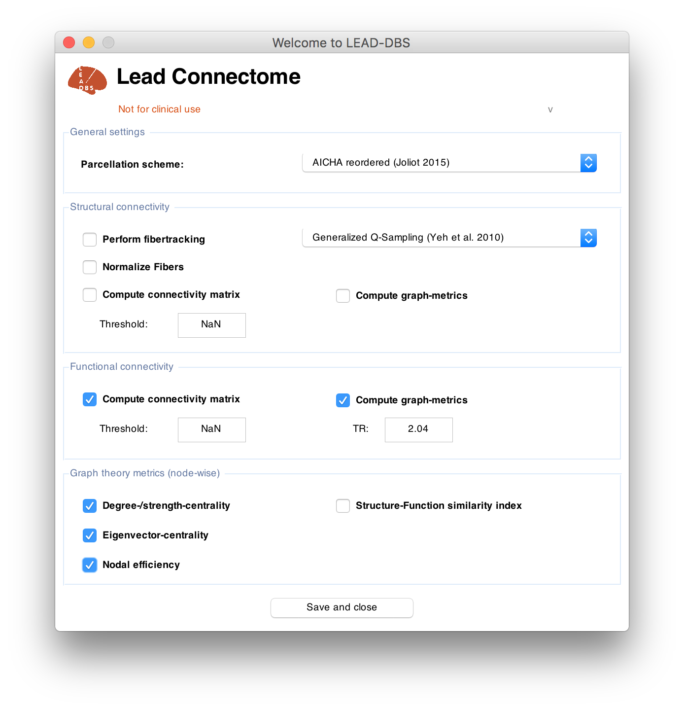
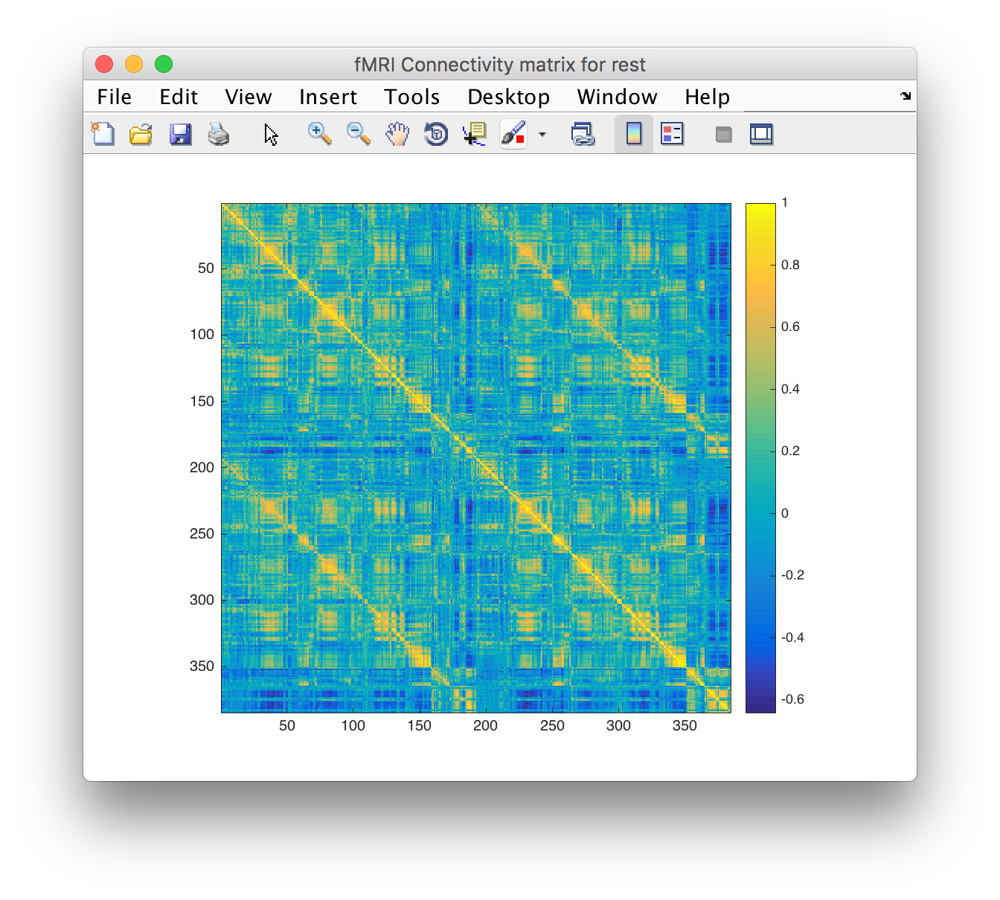

# fMRI-Analysis: Patient Specific Processing

## Data preparation

Lead-DBS looks for files named `res*.nii` inside your patient folders. You can for instance put these files into the patient's folder:

* `rest_on.nii` \(e.g. a rs-fMRI acquisition acquired during stimulation\)
* `rest_off.nii` \(e.g. one acquired in DBS off state\)

Please note that all files need to begin with `res*` and need to end with `.nii`.

_The above example shows a patient directory with files needed to run fMRI & dMRI analyses. Please note that only one run of resting state fMRI needs to be present. You also don't need dti.\_ files to assess functional connectivity \*

These files should be 4D nifti files containing fMRI data acquired at rest. As with any standard names, filenames can be changed by editing the file `ea_prefs.m` inside your Lead-DBS installation.

If your data is composed of multiple sessions, a session vector called `res*_sessvec.mat` needs to be put into the patient folder as well. If your files are named as in the example given above, please name the session vectors

* `rest_on_sessvec.mat` \(specifying sessions of the `rest_on.nii` file\)
* `rest_off_sessvec.mat` \(specifying sessions of the `rest_off.nii` file\).

If you simply put one file \(e.g. `rest.nii`\) inside the folder, place only one session vector file \(`rest_sessvec.mat`\) inside the folder. If you acquired the whole scan in a single session, you don't have to provide any sessvec file at all. The `res*_sessvec.mat` files should contain one _n_ x 1 sized variable named `sessvec`, _n_ being the number of volumes acquired in the session. A hypothetical rs-fMRI scan consting of three sessions, each consisting of 5 volumes should be modeled by a sessvec-vector of:

`sessvec=[1 1 1 1 1 2 2 2 2 2 3 3 3 3 3];`

## Estimation of connectivity matrices or graph theory metrics

To begin the analysis, open the Lead-Connectome `Settings` by clicking on the `Settings` button next to the `Lead-Connectome` checkbox. A new window pops up.

* Choose a parcellation scheme from the popup menu on the top.

  Then check `Compute connectivity matrix` under the panel `Functional connectivity`. Additionally check `Compute graph-metrics` if you wish to write out graph-theory files. If the latter is the case, check which graph-metrics you wish to calculate and export in the `Graph theory metrics (node-wise)` panel. Please note that the `Structure-Function similarity index` may only be calculated if a structural connectivity matrix is present or being calculated, too.

* Enter the correct TR \(repetition time\) of the rs-fMRI acquisition.
* Press `Save and close`.
* Check the `Lead Connectome` checkbox and uncheck all other checkboxes.
* Check the `Normalize` checkbox if you haven't performed normalization on this subject before.
* Press `Run`

 _Lead-Connectome GUI with settings for fMRI-whole brain assessment & graph-theory metric calculation._

Lead-DBS Connectome will now calculate the connectivity matrix and export the grey-matter time series from your rs-fMRI acquisition. Files will be written into

_patient\_folder/connectomics/Name\_of\_selected\_parcellation/_

Advanced parameters – as e.g. whether you wish to perform global signal regression – may be changed by editing the `ea_prefs.m` file inside your Lead-DBS installation folder. Look for entries in the prefs.lc.func struct.

If you are curious about what exactly happens to the data in the preprocessing steps, you can examine the function `ea_extract_timecourses.m`. As in many subfunctions of `Lead-DBS`, there is a hidden flag called `vizz` defined in the first lines of the code. If you set it to 1 and run the above, you will see a figure showing the time courses in each step of the processing pipeline.

 _This figure shows the fMRI connectivity matrix of a patient based on the AICHA reordered \(Joliot 2015\) parcellation scheme. The two prominent off-diagonal lines show high connectivity between homologue areas \(left-/right\) of the parcellation map. Middle and lower/right blue areas \(with lower overall connectivity\) show subcortical areas. In this example, global signal regression has been performed. Pearson's correlation coefficients range from ~-0.6 to 1._

