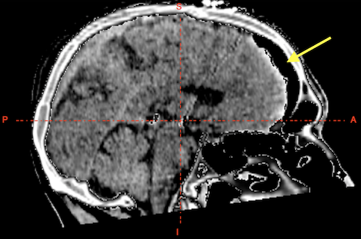
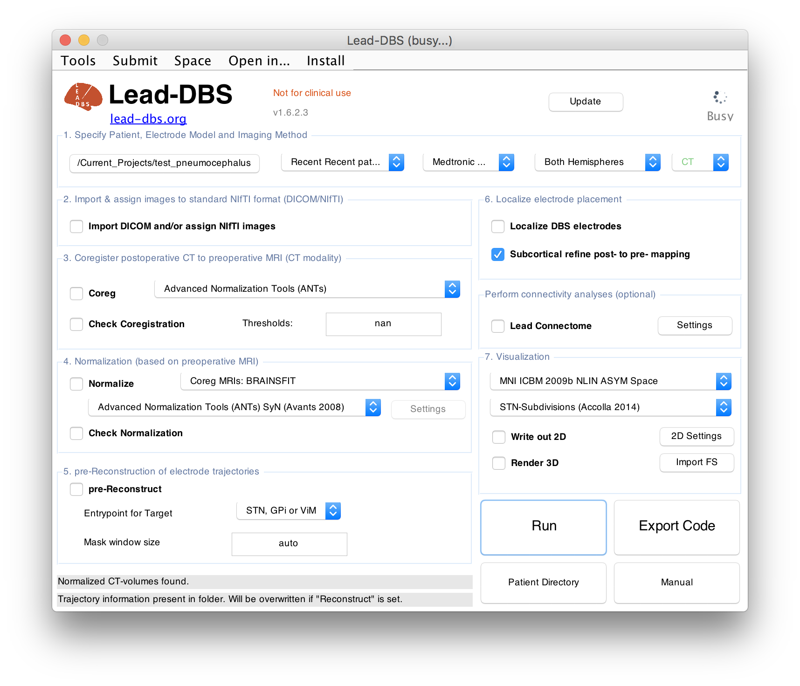
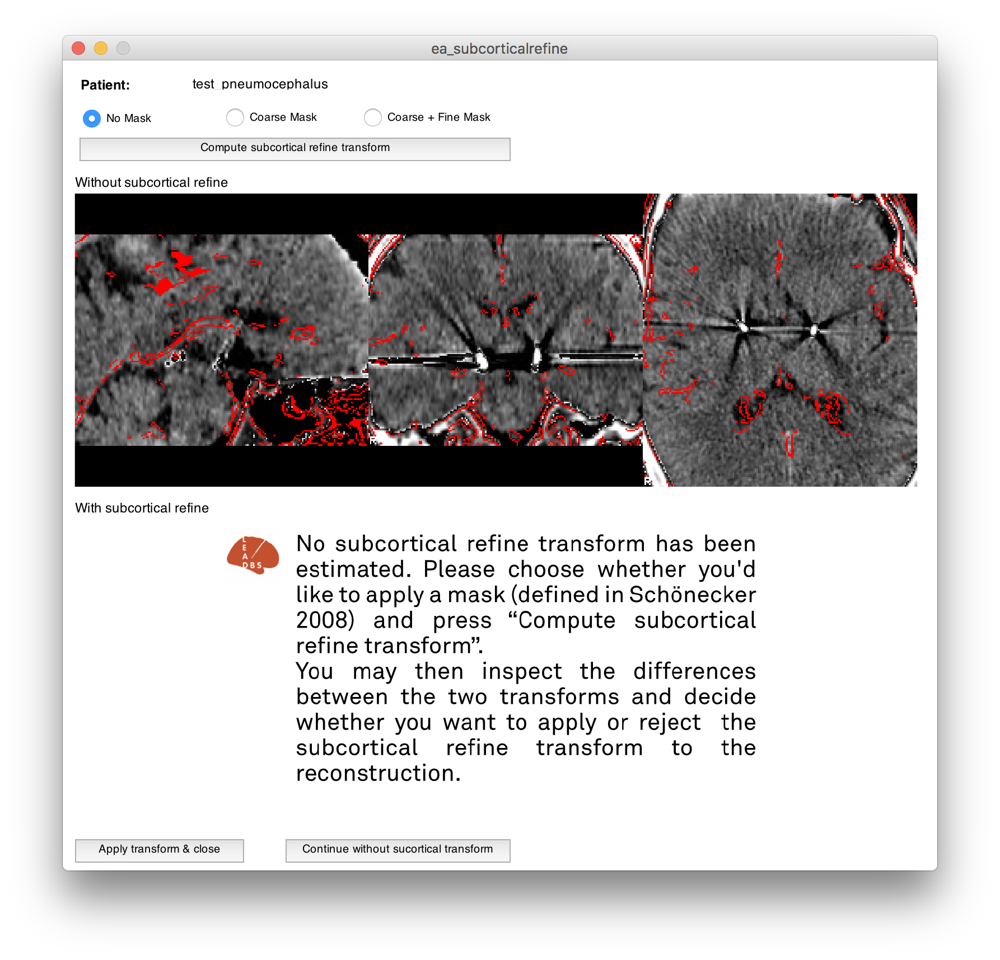
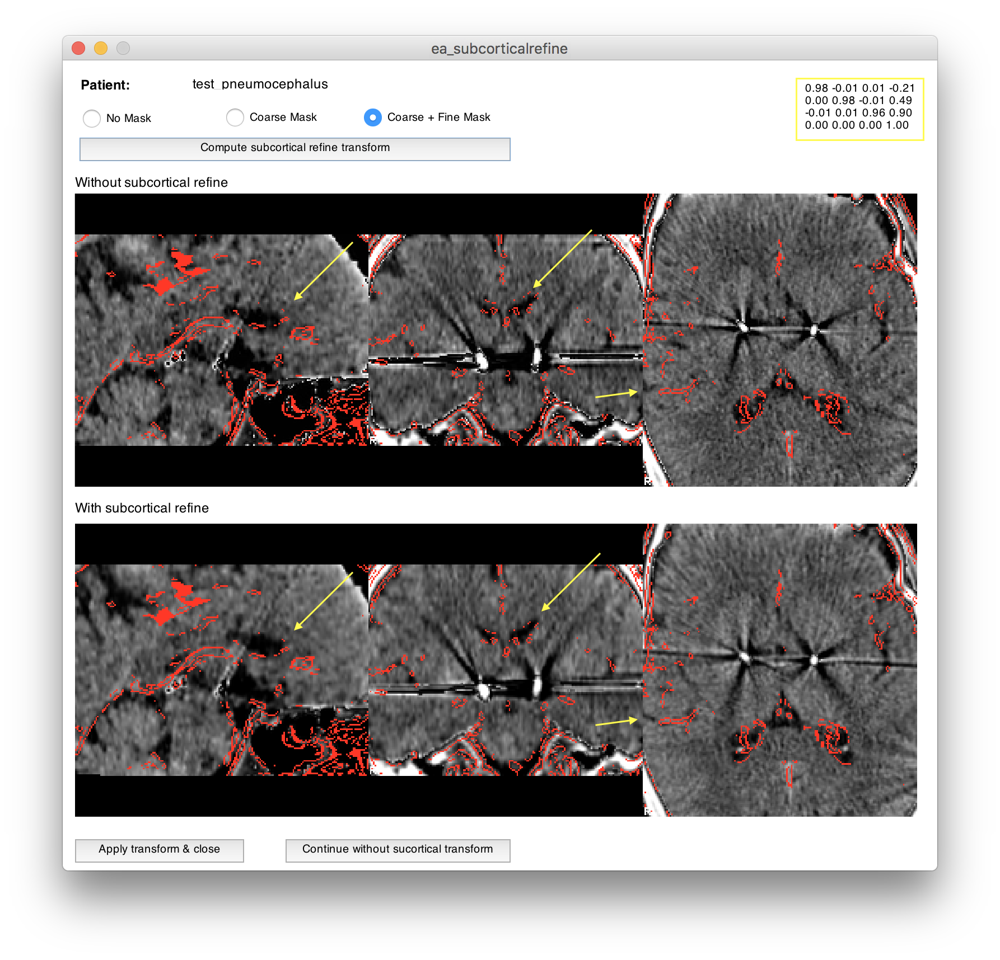

# Brain shift Correction

## Brain shift Correction

### _Subcortical Refine Post- to Pre- transforms_

This part of the processing pipeline is a tool to reduce bias introduced by brain shift.

### Motivation

Brain shift happens when the skull is opened during surgery, it means that the brain \(often nonlinearly\) moves in respect to the skull, e.g. due to pneumocephalus:

_Pneumocephalus shown in a tonemapped CT image. Air has entered the skull after opening boreholes during surgery. The dark area in the frontal portion of the skull \(yellow arrow\) is air that pushes the soft tissue of the brain in occipital direction._

If you aim at co-registering the whole post-op CT volume \(shown above\) to a pre-op MRI of the same patient, linear co-registration may result in a good match of the skull but a wrong co-registration of the brain, especially in frontal regions. Most often, in DBS, we are interested in subcortical regions that could be seen as "remote enough" from the pneumocephalus. Also, most often, there is no substantial brain shift or pneumocephalus to be found and it could be okay to not correct for this issue.

Still, in DBS, millimeters do matter, so we should at least think about and not ignore this bias.

One common strategy in neuroimaging would be to use nonlinear deformations instead of linear transforms. However, in DBS, this is not possible, since the electrodes \(in the postop image\) would be considered as part of the tissue and could be nonlinearly moved _within_ the brain. If this is not clear to you, consider taking a moment to think about why this is exactly what we _do not_ want: Since we are interested in the relative location of the DBS electrodes in respect to other brain structures, we should _never apply a nonlinear transform between postop- and preop- images_.

A solution that may drastically reduce the bias introduced by brainshift instead is to still use linear transforms but apply them to subcortical regions of interest only:

_Solution to reduce bias by brainshift as implemented in Lead-DBS. Top row: Standard approach which may lead to significant error if pneumocephalus is present. To account for this, you can refine the linear transform of the top row by using a bounding box \(mid row\) or by further applying masks of interest published by Schönecker 2008 \(and graciously shared for use in Lead-DBS by Thomas\)._

### How to fix it

The way the above implemented in Lead-DBS, you first go through rough co-registration, normalization to template space and even do reconstruct electrodes in native space first.

Then, in a final step, the subcortical refine transform is estimated and can be applied \(or rejected\) to the reconstruction at any time.

Thus, this is the final step before visualizing your data:

To open the subcortical refine window, after reconstructing DBS electrodes, select `Brainshift correction` and press `Run`. This will open up the following window:

As you can see in the lower panel, no subcortical refine transform has been estimated. This process will also create a folder called scrf \(for "**s**ub**c**ortical **r**e**f**ine"\) inside your patient directory.

To estimate a transform, choose either `No Mask`, `Coarse Mask` or `Coarse + Fine Mask`. The first will just use the cropped images \(as shown in the upper panel\) to estimate the transform. As you can see in the upper right corner of the sagittal plane, there still is some pneumocephalus to be seen in this cropped version of the volume. Thus, applying a mask could further improve results. By choosing `Coarse Mask`, a larger mask will be applied. If you choose to use both masks, the coarse mask \(blue mask in the Schönecker pulication\) will be applied first, followed by the finer \(yellow\) mask.

In our example, let's max it out and use the `Coarse + Fine Mask` option. This will produce the following result:

As highlighted by the yellow arrows, some regions better overlap in this refined transform. The estimated transformation matrix is printed to the top right corner of the figure.

You can use a slice viewer \(such as e.g. [3D Slicer](http://slicer.org%29\) to further examine results in detail. The relevant files will be in

`patient folder/scrf/`

and if using default settings will be called

`anat_*.nii` \(preoperative image\)

`movim.nii` \(rough affine registered postoperative image\)

`scrfmovim.nii` \(refined registered postoperative image\)

If you think the approach improved results, simply click `Apply transform & close` to apply the transform to your DBS electrode reconstructions. If not, simply click `Continue without subcortical transform`.

### Some technical background information

* In theory, subcortical refines could be applied together with coarse refines "in one go". We did use this strategy in earlier versions of Lead-DBS. However, the process was not robust enough and could not be implemented using all software available in Lead-DBS, in the same way. Furthermore, especially when dealing with postoperative CTs or significant electrode artifacts on MRI, many users sometimes manually apply a whole-brain coregistration in different software \(such as [3D Slicer](http://slicer.org%29\) if the options in Lead-DBS do not generate sufficient results. That's why we did choose to include this refine step as the very end of our pipeline. First make sure a best possible whole-brain coregistration, good normalization and precise reconstruction is in place, then apply this subcortical refine step to the data.
* We do estimate the refine transform on interpolated & resliced data which is usually not the best to do. Reasons are similar to the above and that the process is _much_ more robust and universal this way. This practice allows us to support all the linear transform methods implemented in Lead-DBS \(SPM, FSL, ANTs, BRAINSFit or hybrid solutions\) in the same way. To account for the disadvantages of using coregistered and resliced data to estimate transforms, we do apply the transform to non-discretized points in float format and use high resolution data throughout the whole pipeline.
* The subcortical refine step hard-codedly uses ANTs, so here you don't have the option to choose from a multitude of software. This is due to the fact that any software would probably get these transforms right since images should already be pretty much aligned at this point. We use a layered transform composed of rigid, affine \[and mask1, mask2 if masks are used\] stages in this final ANTs registration step.

> As a side note:  
> _This processing step was completely implemented into Lead-DBS during the_ [_2017 brainhack global event at MIT in Boston_](https://brainhack-boston.github.io/)_.  
> Many thanks go out to the organizers of the event – as always @ brainhack, it was phenomenal._
>
> 

_ah_

